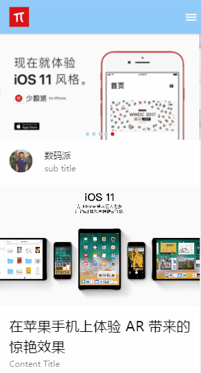

# Vue-sspai——基于Vue2实现的仿少数派单页面应用

## 概述

使用Vue2进行的仿少数派的webapp的制作，在ui上，参考了设计师kaokao的作品，作品由个人独立开发。


项目地址 `https://github.com/nicoviv/Vue-ssapi`

## 项目已实现功能




## Build Setup

``` bash
# 下载项目运行需要的依赖
npm install

# 运行(端口8877)
npm run dev

# 发布
npm run build

# 生产环境
npm run build --report
```
